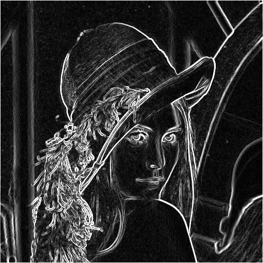

Edge detection

Edges in a gray scale image can be detected using sobel filter.

Input image:

Edge detected images:

1) Edges detected in the x direction using 2d convolution with sobel filter

2) Edges detected in the y direction using 2d convolution with sobel filter

3) Final output of 2d convolution with sobel filter

4) Edges detected in the x direction using 1d convolution with sobel filter

5) Edges detected in the y direction using 2d convolution with sobel filter

6) Final output of 2d convolution with sobel filter

