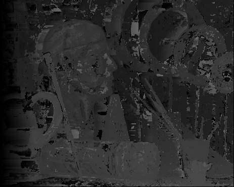
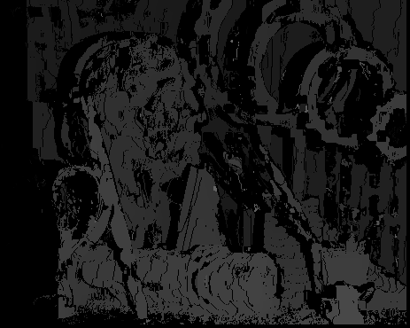

# Stereo Vision

1. Disparity estimation using block matching:

Left disparity map – using 3x3 block:

Right disparity map- using 3x3 block:

Left disparity map – using 9x9 block:

Right disparity map- using 9x9 block:

Left disparity map – using 3x3 block – consistency checked:

Right disparity map- using 3x3 block – consistency checked:

Left disparity map – using 9x9 block – consistency checked:

Right disparity map - using 9x9 block – consistency checked:

Calculated MSE values:

Left depth map 3x3 MSE= 437.3528573930302

Left depth map 9x9 MSE= 441.9508493374584

Right depth map 3x3 MSE= 344.985044655887

Right depth map 9x9 MSE= 335.8602766913782

Left consistency checked depth map 3x3 MSE= 116.59487683983502

Left cosnistency checked depth map 9x9 MSE= 54.172589908001115

Right cosnistency checked depth map 3x3 MSE= 119.98259487683984

Right cosnistency checked depth map 9x9 MSE= 57.0862001672707

2. Disparity estimation using Dynamic Programming:

Left disparity map:

Right disparity map:

3.View Synthesis:

Synthesized view: (view3):

.png)

